[](https://www.jfx-central.com/libraries/gemsfx)
[](https://search.maven.org/search?q=g:com.dlsc.gemsfx%20AND%20a:gemsfx)
[](https://opensource.org/licenses/Apache-2.0)
[](https://github.com/openjdk/jdk)
[](https://github.com/openjdk/jfx)

# GemsFX

GemsFX is a collection of custom controls and utilities for JavaFX.

## Installation
Adding GemsFX to your project.

#### Using Maven
Add the following dependency to your pom.xml:
<span id="maven-dependency"></span>
```xml
<dependency>
    <groupId>com.dlsc.gemsfx</groupId>
    <artifactId>gemsfx</artifactId>
    <version>2.16.0</version>
</dependency>
```

#### Using Gradle
Add the following dependency to your build.gradle:
<span id="gradle-dependency"></span>
```groovy
implementation 'com.dlsc.gemsfx:gemsfx:2.16.0'
```

## Quick Links

- #### Date & Time Controls
  [CalendarView](#calendar-view), [CalendarPicker](#calendar-picker), [DateRangeView](#date-range-view), [DateRangePicker](#date-range-picker),[YearView](#year-view), [YearPicker](#year-picker), [YearMonthView](#year-month-view), [YearMonthPicker](#year-month-picker), [TimePicker](#time-picker), [DurationPicker](#duration-picker)
- #### Text Input Controls
  [SearchTextField](#search-text-field), [SearchField](#search-field), [EnhancedPasswordField](#enhanced-password-field), [EmailField](#email-field), [TagsField](#tags-field), [ExpandingTextArea](#expanding-text-area), [ResizableTextArea](#resizable-text-area), [LimitedTextArea](#limited-text-area)
- #### Advanced Panes
  [DialogPane](#dialog-pane), [DrawerStackPane](#drawer-stack-pane), [PowerPane](#power-pane), [ResponsivePane](#responsive-pane)
- #### Image controls
  [PhotoView](#photo-view), [AvatarView](#avatar-view), [PaymentOptionControls](#payment-option-controls), [SVGImageView](#svg-image-view)
- #### Other Controls
  [CircleProgressIndicator](#circle-progress-indicator), [FilterView](#filter-view), [InfoCenterPane](#info-center-pane), [StripView](#strip-view), [Spacer](#spacer), [ScreensView](#screens-view), [SessionManager](#session-manager), [StageManager](#stage-manager), [TreeNodeView](#tree-node-view), [MultiColumnListView](#multi-column-list-view)

## CalendarView

<span id="calendar-view" ></span>

A nice UI for displaying the month of a year. The view is highly configurable and allows specifying
latest and earliest date for selection purposes. The days of the previous or the next month can either
be shown or hidden. When clicking on the month the user will be presented with a custom view for quickly
selecting a different month. The same happens when clicking on the year. The calendar view uses a
selection model which can work in three ways: single date selection, multiple date selection, or date range
selection. Last but not least, the layout of the header can be changed, so that the month and year labels
are either left, center, or right aligned.


## CalendarPicker

<span id="calendar-picker" ></span>

A date picker control that uses the calendar view of GemsFX. The field is editable to the
user can also enter the date via keyboard.


## DateRangeView

<span id="date-range-view" ></span>

A view that allows the user to specify a date range. The view supports defining a couple of presets
for quick range selection, e.g. "last week". The left and right month views are bound so that the
right calendar will never allow the user to specify a date that is earlier than those dates shown in
the left month view.

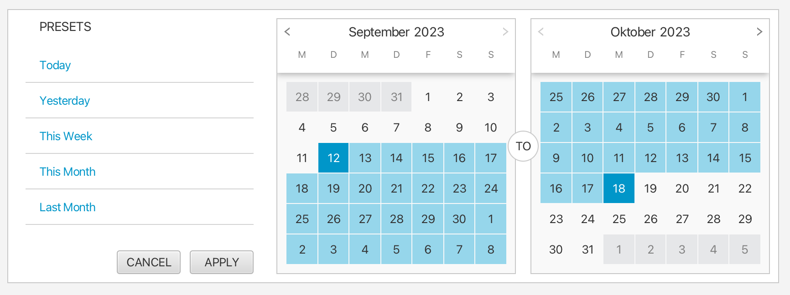

## DateRangePicker

<span id="date-range-picker" ></span>

A picker that allows the user to specify a date range via the date range view. The picker supports
two different layouts (small, big). The picker shows the selected range and also a name for the range,
which is either derived from the name of a selected preset or simply says something like "custom range".

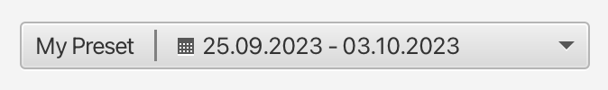


## YearView

<span id="year-view" ></span>

A view for displaying a configurable number of columns and rows with years. The user can use the grid
to quickly select a new year. Properties are available to restrict the earliest and the latest year that
is selectable.

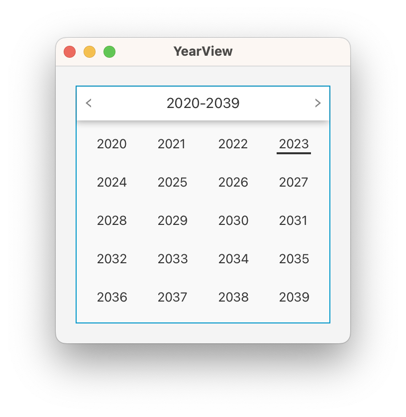

## YearPicker

<span id="year-picker"></span>

A view for picking a year from a dropdown showing the year view control.


## YearMonthView

<span id="year-month-view"></span>

A view for displaying the months of a given year. The user can quickly switch between years. Properties
are available to restrict the selection to an earliest and a latest month.

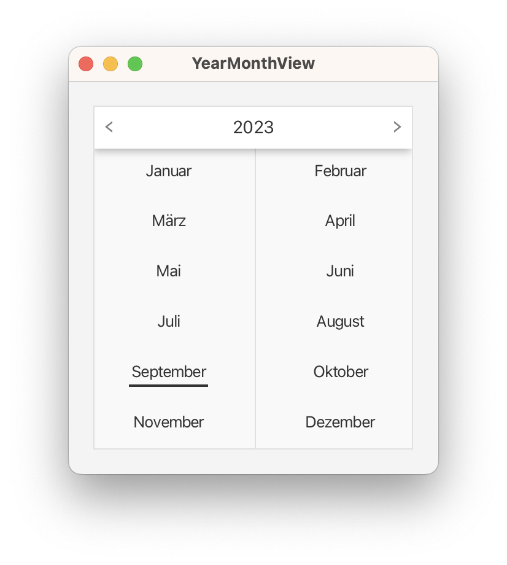

## YearMonthPicker

<span id="year-month-picker"></span>

A control for specifying the month of a year (see time API class "YearMonth"). It is very similar to the standard date
picker class
and actually inherits a lot of styling attributes from it.

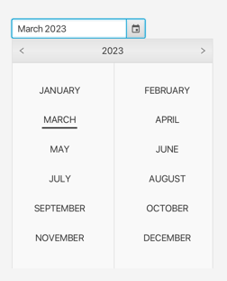

## TimePicker

<span id="time-picker"></span>

A small control used for entering a time. The control can be configured with a "step rate" for the minutes field (e.g. "
15 minutes") that will be used when
incrementing or decrementing the minutes field via the keyboard (arrow keys). The control can also be configured to only
allow a time within the time range
defined by an earliest and a latest time. A popup can be used to work with the mouse only. It is also possible to
specify whether the fields should "roll over"
or not when they reach their minimum or maximum value. For example: the minute field shows 59 minutes and the user wants
to increase it via the arrow key. Then
the new value will be "0" when rollover is enabled. If not the value will remain at 59. Rollover combined with "linking
fields" will cause the hours field to
get increased when the minute field rolls over from 59 to 0 or decreased when the minute field rolls over from 0 to 59.

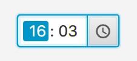

## DurationPicker

<span id="duration-picker"></span>

A small control used for entering a duration. The control can be configured to only allow a duration within the range
defined by a minimum and maximum duration. A popup can be used to work with the mouse only. It is also possible to
specify whether the fields should "roll over"
or not when they reach their minimum or maximum value. The control supports similar features as the time picker:
rollover fields, keyboard support, linking fields,
filling fields with leading zeros, etc..

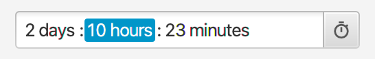

## SearchTextField

<span id="search-text-field"></span>

A textfield that has been nicely decorated to express that it is used for performing searches.


## Search Field

<span id="search-field"></span>

An auto-suggest text field with a behaviour similar to the spotlight search experience on Mac. While typing the field
will automatically finish the entered text if it has a search result where the name starts with the exact typed text. At
any time the typed text and the auto-completed text will be visually distinguishable. The field is also capable of
creating a new object for the entered text if no result can be found. For detailed
instructions [read the WIKI page](https://github.com/dlsc-software-consulting-gmbh/GemsFX/wiki/SearchField).


## EnhancedPasswordField

<span id="enhanced-password-field"></span>

The EnhancedPasswordField is a custom password field. It allows the addition of custom nodes like icons or buttons to the sides of the field,
supports toggling password visibility between masked and plain text, and enables customization of the echo character used for masking.


## Email Field

<span id="email-field"></span>

A text field that has been nicely decorated to express that it is used for entering email addresses. The field will
validate the entered text and show an error message if the text is not a valid email address.

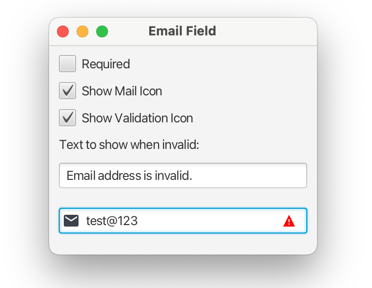

## Tags Field

<span id="tags-field"></span>

An extension of the SearchField control that supports the creation of tags. Selected values are converted into tags when
the user hits enter, the right arrow key, or tab. The API of this control allows applications to retrieve the tags, or
to monitor the selection state of the tags. The control uses a FlowPane for its layout, which allows the tags to span
multiple rows.

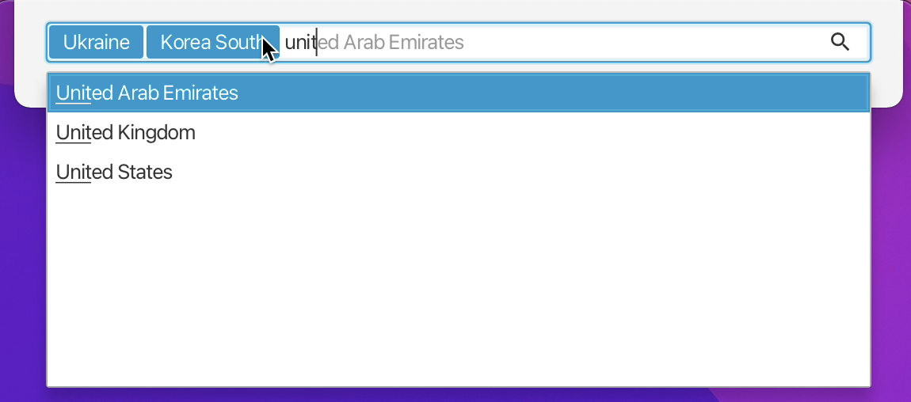

## Expanding Text Area

A customized text area that grows based on its text content. The text area will never show vertical or horizontal
scrollbars.

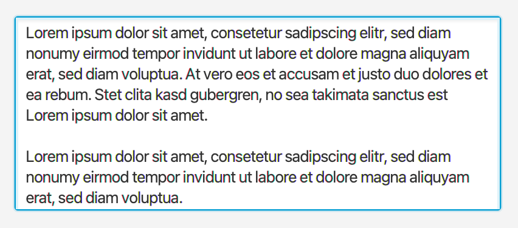

## Resizable Text Area

<span id="resizable-text-area"></span>

A custom control that wraps a text area and adds a resize handle to the lower right corner of it. The area can be
configured to be resizable in vertical, horizontal, or both directions.


## Limited Text Area

<span id="limited-text-area"></span>

LimitedTextArea is derived from ResizableTextArea and offers a character-limiting feature,
accompanied by a character counter that indicates the remaining number of characters.


## Dialog Pane

<span id="dialog-pane"></span>

The class DialogPane can be used as a layer on top of any application. It offers various methods to display different
types of dialogs.

* Information
* Warning
* Error
* Confirmation
* Node (any UI)
* Busy (spinning animation, indeterminate)
* Single line text input
* Multiple line text input

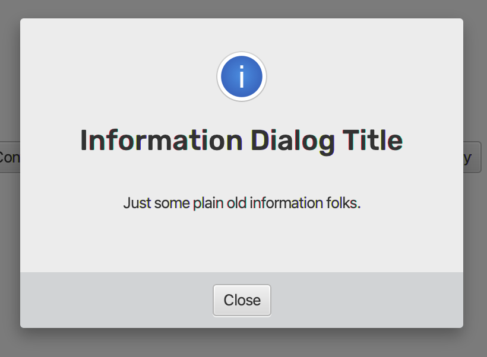

## DrawerStackPane

<span id="drawer-stack-pane"></span>

A stackpane with an optional node that can be shown inside a drawer. The drawer is animated and can slide in and out.
When the drawer is showing a semi-transparent glass pane will cover the background. In addition the last height of the
drawer can be persisted via the preferences API so that next time the drawer will show itself like in the last user
session.

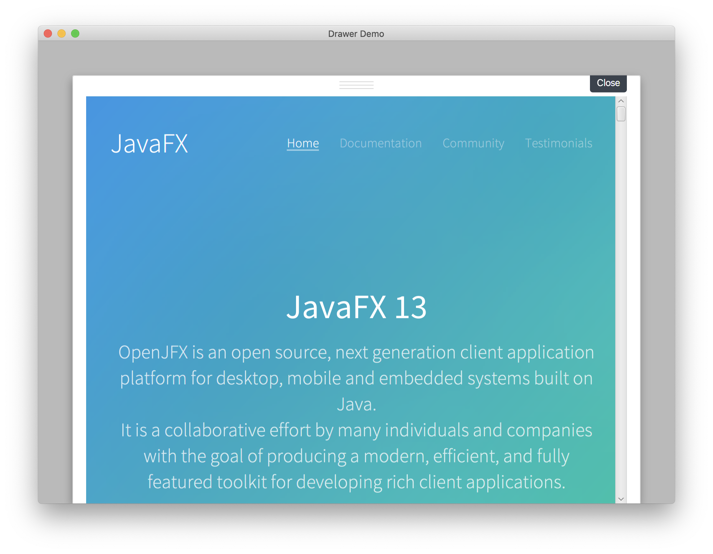

## PowerPane

<span id="power-pane"></span>

The PowerPane is a versatile container that combines specialized panes such as the InfoCenterPane, DialogPane,
DrawerStackPane, and HiddenSidesPane. It serves as an ideal foundation for crafting feature-rich client applications.


## ResponsivePane

<span id="responsive-pane"></span>

ResponsivePane is a container that allows for responsive behavior of a sidebar and a main content panel.
Depending on the specified position of the sidebar (LEFT or RIGHT), it will automatically adjust its visibility
based on the width of the pane. When the window width is narrow, the sidebar is hidden, and only the content panel is
shown.
When the window width is moderate, both a small sidebar and a large sidebar, along with the content panel, are
displayed.
When the window width is wide, both the large sidebar and the main content pane are shown.
Similarly, if the sidebar is positioned at the TOP or BOTTOM, its visibility will be adjusted based on the height of the
pane.
However, it is also possible to force the sidebar to be displayed regardless of the window size.


## Photo View

<span id="photo-view"></span>

A control for adding and editing a user profile photo (or whatever). The user can click on the control to choose an
image file
via a file chooser (replacable) or via drag and drop. Once added the user can move the image around and zoom in / out.
As a convenience
the view always provide a cropped version of the original image. This allows applications to store a smaller file on the
server / in
the database. The control supports some keyboard shortcuts. The file chooser can be activated by pressing SPACE or
ENTER. The photo can
be removed by pressing DELETE or BACK_SPACE.


## Avatar View
<span id="avatar-view"></span>

AvatarView is a control for displaying user avatars. This component can show either a user's profile image or the initials of their name (if no image is provided or the image has not finished loading). It allows setting the avatar shape to be either circular or rectangular, with customizable corner rounding for rectangular avatars and adjustable avatar size.

Compared to `PhotoView`, `AvatarView` offers a simpler functionality primarily for displaying avatars. If you need more advanced features such as adding and editing profile photos via a file chooser or drag-and-drop, and the ability to move and zoom the image, PhotoView is a better choice.
If your requirement is simply to display a user's avatar, then AvatarView is a more lightweight option.


## Payment Option Controls

<span id="payment-option-controls"></span>

A specialized subclass of ImageView that can be used to display different graphics for different payment options.
Graphics provided by Gregoire Segretain (https://www.sketchappsources.com/contributor/gregoiresgt)

 

## SVGImageView

<span id="svg-image-view"></span>

A control used for rendering SVG image files. Utilizing the [jsvg](https://github.com/weisJ/jsvg) library, ensuring
high-definition quality even when scaled.

- Packaging Note: Not suitable for native packaging yet due to AWT dependency.
- Content Note: Static only for now; future jsvg updates may add animation.
- Development Note: [jsvg](https://github.com/weisJ/jsvg) is evolving and does not yet support all features of the SVG
  specification.

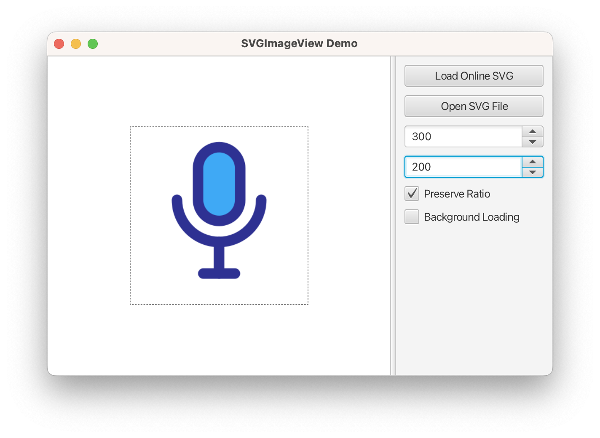

## Circle Progress Indicator

<span id="circle-progress-indicator"></span>

A control for displaying a circular progress indicator. The control can be configured to show a percentage value or a
text value. The control can also be configured to show a progress bar.


## FilterView

<span id="filter-view"></span>

A control for filtering the content of an observable list. Works in combination with TableView, ListView, or any control
that is based on observable lists.


## InfoCenterPane

<span id="info-center-pane"></span>

A view for displaying (groups of) notifications. Incoming / new notifications slide-in via an animation. Each group can
have its own factory for the creation of notification views. A group with multiple notifications can be shown stacked or
expanded. A threshold can be defined to determine the maximum number of notifications that can be shown. If the
notifcation count is higher than the threshold then the user can switch to a list view showing them all. Groups can be
pinned so that they always stay in the top position without being scrolled out of view.

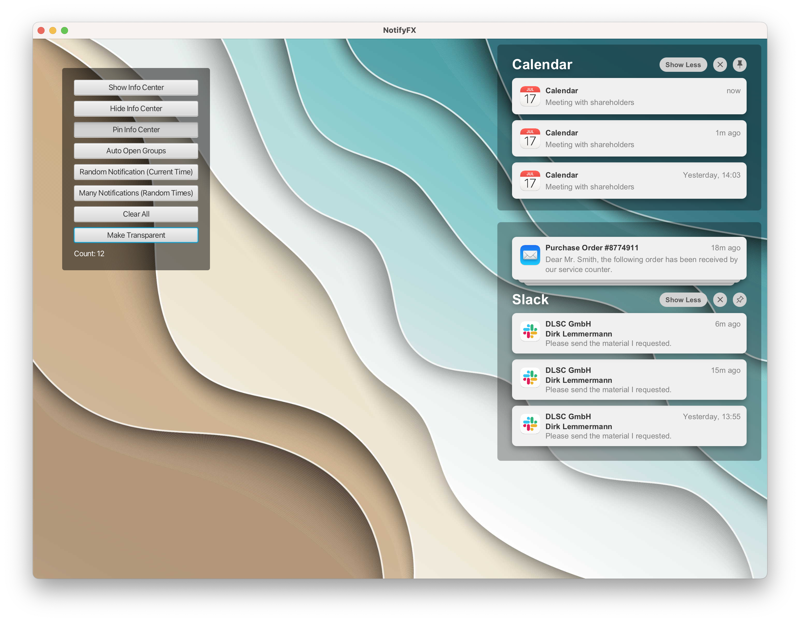

## StripView

<span id="strip-view"></span>

A view for horizontally positioning a number of nodes, one for each item added to the view's model. Scroll buttons will
become visible on either side of the view if the available width is not sufficient to show all items / nodes. Scrolling
is animated (can be turned off). The nodes on either side are fading out so that the scroll controls are completely
visible. The view also supports the single selection of an item.


## Spacer

<span id="spacer"></span>

Spacer extends Region and is designed to create flexible spaces in container layouts, especially in HBox and VBox.
Within an HBox, the Spacer grows horizontally. Within a VBox, it grows vertically. When the activeProperty is set to
false, the Spacer will not grow.

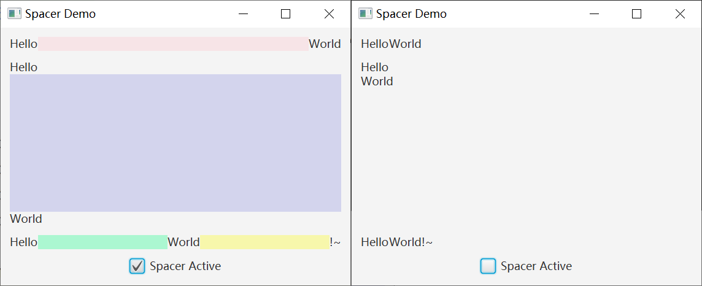

## ScreensView

<span id="screens-view"></span>

A small control that can be used to display the screen geometries as seen by the application. The view can also
display the application's windows, and some arbitrary shapes (might be useful for debugging purposes).


## Session Manager

<span id="session-manager"></span>

The `SessionManager` class is a utility class that can be used to monitor observables and persist them across user
sessions. This can be useful, for example, for storing and restoring the position of the divider of a SplitPane.

## Stage Manager

<span id="stage-manager"></span>

The `StageManager` class is a utility class that keeps track of a stage's location and dimensions. These values
will be stored and used across user sessions via the `java.util.prefs` API.

## Tree Node View

<span id="tree-node-view"></span>

A view for displaying a tree of nodes.

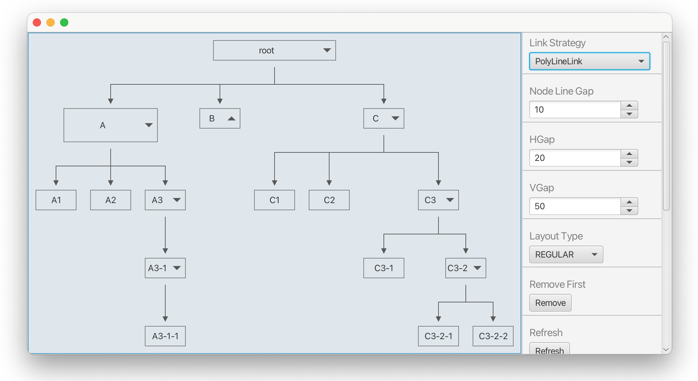

## Multi Column List View

<span id="multi-column-list-view"></span>

A view for displaying multiple columns where each column consists of a header control and a ListView.
The control allows the user to rearrange the items in each ListView and also to drag and drop items from one column to
another.

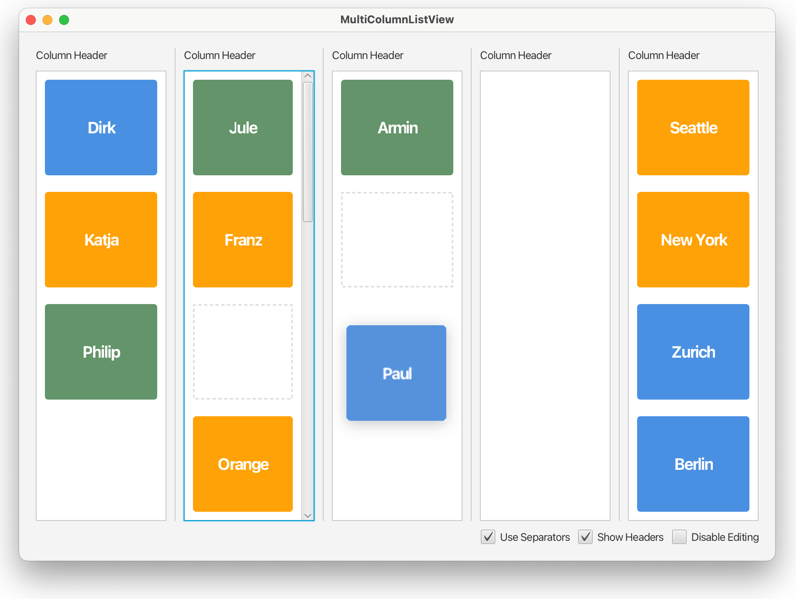

## Text View

The TextView control can be used for displaying multi-line text. It includes the ability to select and 
copy text. Limitation: the user can select only words, not parts of a word.

## Running the demos

You can run the demos using Maven by typing any of the following lines into your
terminal:

    mvn javafx:run -f gemsfx-demo/pom.xml -Dmain.class=com.dlsc.gemsfx.demo.DialogPaneApp
    mvn javafx:run -f gemsfx-demo/pom.xml -Dmain.class=com.dlsc.gemsfx.demo.DrawerStackPaneApp
    mvn javafx:run -f gemsfx-demo/pom.xml -Dmain.class=com.dlsc.gemsfx.demo.DurationPickerApp
    mvn javafx:run -f gemsfx-demo/pom.xml -Dmain.class=com.dlsc.gemsfx.demo.EmailFieldApp
    mvn javafx:run -f gemsfx-demo/pom.xml -Dmain.class=com.dlsc.gemsfx.demo.EnhancedLabelApp
    mvn javafx:run -f gemsfx-demo/pom.xml -Dmain.class=com.dlsc.gemsfx.demo.ExpandingTextAreaApp
    mvn javafx:run -f gemsfx-demo/pom.xml -Dmain.class=com.dlsc.gemsfx.demo.FilterViewApp
    mvn javafx:run -f gemsfx-demo/pom.xml -Dmain.class=com.dlsc.gemsfx.demo.InfoCenterApp
    mvn javafx:run -f gemsfx-demo/pom.xml -Dmain.class=com.dlsc.gemsfx.demo.PaymentOptionApp
    mvn javafx:run -f gemsfx-demo/pom.xml -Dmain.class=com.dlsc.gemsfx.demo.PaymentOptionTilesApp
    mvn javafx:run -f gemsfx-demo/pom.xml -Dmain.class=com.dlsc.gemsfx.demo.PhotoViewApp
    mvn javafx:run -f gemsfx-demo/pom.xml -Dmain.class=com.dlsc.gemsfx.demo.ResizableTextAreaApp
    mvn javafx:run -f gemsfx-demo/pom.xml -Dmain.class=com.dlsc.gemsfx.demo.SearchFieldApp
    mvn javafx:run -f gemsfx-demo/pom.xml -Dmain.class=com.dlsc.gemsfx.demo.SearchTextFieldApp
    mvn javafx:run -f gemsfx-demo/pom.xml -Dmain.class=com.dlsc.gemsfx.demo.TagsFieldApp
    mvn javafx:run -f gemsfx-demo/pom.xml -Dmain.class=com.dlsc.gemsfx.demo.TimePickerApp
