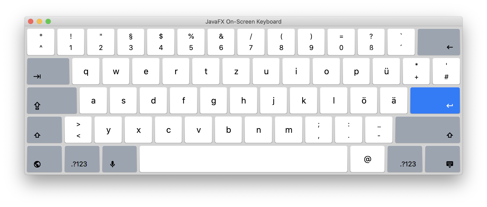
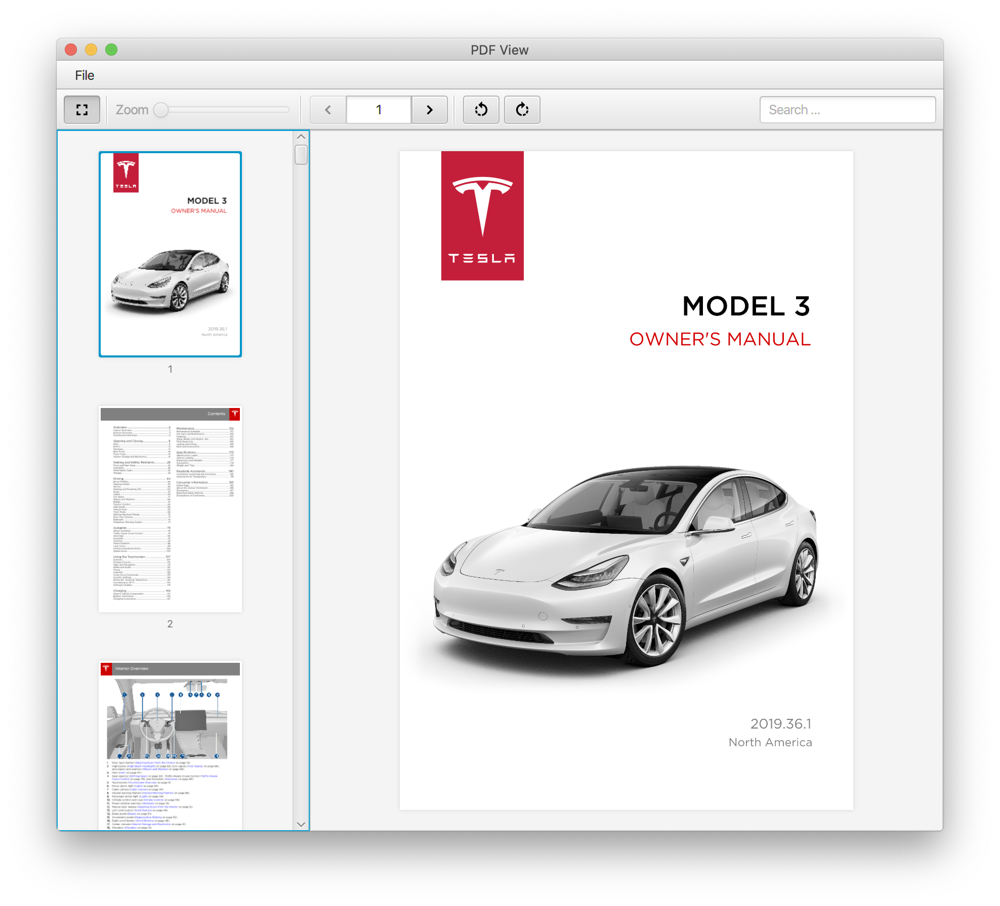
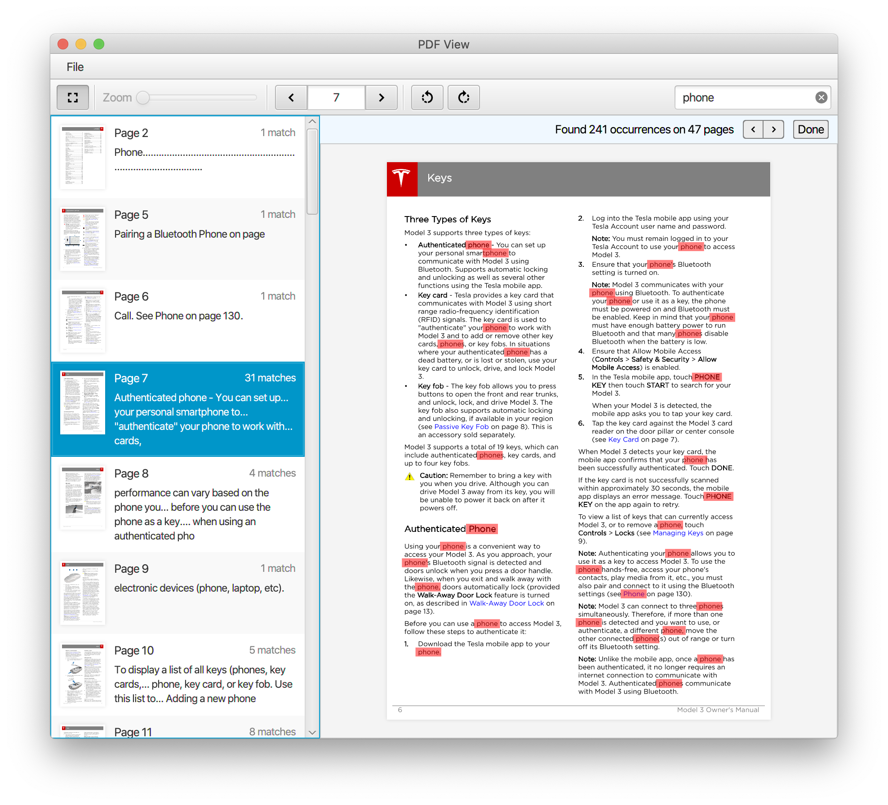
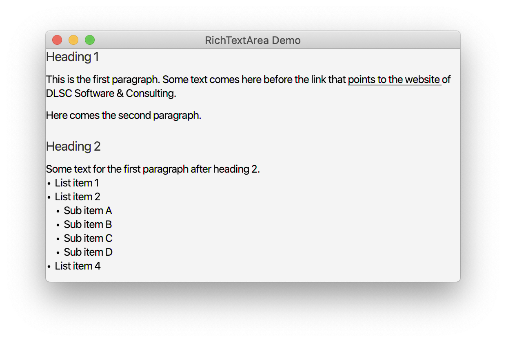

# GemsFX

*At least **JDK 11** is required.*

## Time Picker

A small control used for entering a time. The control can be configured with a "step rate" for the minutes field (e.g. "15 minutes") that will be used when
incrementing or decrementing the minutes field via the keyboard (arrow keys). The control can also be configured to only allow a time within the time range
defined by an earliest and a latest time. A popup can be used to work with the mouse only. It is also possible to specify whether the fields should "roll over"
or not when they reach their minimum or maximum value. For example: the minute field shows 59 minutes and the user wants to increase it via the arrow key. Then
the new value will be "0" when rollover is enabled. If not the value will remain at 59. Rollover combined with "linking fields" will cause the hours field to 
get increased when the minute field rolls over from 59 to 0 or decreased when the minute field rolls over from 0 to 59.


## Duration Picker

A small control used for entering a duration. The control can be configured to only allow a duration within the range
defined by a minimum and maximum duration. A popup can be used to work with the mouse only. It is also possible to specify whether the fields should "roll over"
or not when they reach their minimum or maximum value. The control supports similar features as the time picker: rollover fields, keyboard support, linking fields, 
filling fields with leading zeros, etc..


## Photo View

A control for adding and editing a user profile photo (or whatever). The user can click on the control to choose an image file
via a file chooser (replacable) or via drag and drop. Once added the user can move the image around and zoom in / out. As a convenience
the view always provide a cropped version of the original image. This allows applications to store a smaller file on the server / in
the database. The control supports some keyboard shortcuts. The file chooser can be activated by pressing SPACE or ENTER. The photo can
be removed by pressing DELETE or BACK_SPACE.


## Payment Option Controls

A specialized subclass of ImageView that can be used to display different graphics for different payment options. Graphics provided by Gregoire Segretain (https://www.sketchappsources.com/contributor/gregoiresgt)

 

## Keyboard / KeyboardPane

An on-screen keyboard, especially useful for touch applications (mobile, tablet).



## PDFView

A custom control that allows an application to display PDF files. The control utilizes Apache's PDFBox project.



The view has excellent built-in search capabilities.



## DrawerStackPane

A stackpane with an optional node that can be shown inside a drawer. The drawer is animated and can slide in and out. When the drawer is showing a semi-transparent glass pane will cover the background. In addition the last height of the drawer can be persisted via the preferences API so that next time the drawer will show itself like in the last user session.


## FilterView

A control for filtering the content of an obserable list. Works in combination with TableView, ListView, or any control that is based on observable lists.


## RichTextArea

A read-only text area that is capable of displaying nicely formatted text. The control comes with a rich model and a fluent API that will allow you to quickly compose rich text.



```java
RichTextArea area = new RichTextArea();
        area.setDocument(
                RTDocument.create(
                        RTHeading.create("Heading 1"),
                        RTParagraph.create(
                                RTText.create("This is the first paragraph. "),
                                RTText.create("Some text comes here before the link that "),
                                RTLink.create("points to the website ", "https://www.dlsc.com"),
                                RTText.create("of DLSC Software & Consulting.")
                        ),
                        RTParagraph.create(
                                RTText.create("Here comes the second paragraph.")
                        ),
                        RTParagraph.create(),
                        RTHeading.create("Heading 2"),
                        RTParagraph.create(
                                RTText.create("Some text for the first paragraph after heading 2."),
                                RTList.create(
                                        RTListItem.create("List item 1"),
                                        RTListItem.create("List item 2"),
                                        RTListItem.create("List item 3",
                                                RTList.create(
                                                        RTListItem.create("Sub item A"),
                                                        RTListItem.create("Sub item B"),
                                                        RTListItem.create("Sub item C"),
                                                        RTListItem.create("Sub item D")
                                                )
                                        ),
                                        RTListItem.create("List item 4")
                                )
                        )
                )
        );
```

## Running the demos

You can run the demos using Maven by typing any of the following lines into your
terminal:

    mvn javafx:run -f gemsfx-demo/pom.xml -Dmain.class=com.dlsc.gemsfx.demo.EnhancedLabelApp
    mvn javafx:run -f gemsfx-demo/pom.xml -Dmain.class=com.dlsc.gemsfx.demo.KeyboardApp
    mvn javafx:run -f gemsfx-demo/pom.xml -Dmain.class=com.dlsc.gemsfx.demo.KeyboardDarkApp
    mvn javafx:run -f gemsfx-demo/pom.xml -Dmain.class=com.dlsc.gemsfx.demo.KeyboardPaneDemoApp
    mvn javafx:run -f gemsfx-demo/pom.xml -Dmain.class=com.dlsc.gemsfx.demo.KeyboardPaneWithArrowKeysApp
    mvn javafx:run -f gemsfx-demo/pom.xml -Dmain.class=com.dlsc.gemsfx.demo.PDFViewApp
    mvn javafx:run -f gemsfx-demo/pom.xml -Dmain.class=com.dlsc.gemsfx.demo.DrawerApp
    mvn javafx:run -f gemsfx-demo/pom.xml -Dmain.class=com.dlsc.gemsfx.demo.FilterViewApp
    mvn javafx:run -f gemsfx-demo/pom.xml -Dmain.class=com.dlsc.gemsfx.demo.RichTextAreaApp
    mvn javafx:run -f gemsfx-demo/pom.xml -Dmain.class=com.dlsc.gemsfx.demo.EmailFieldApp
    mvn javafx:run -f gemsfx-demo/pom.xml -Dmain.class=com.dlsc.gemsfx.demo.PaymentOptionApp
    mvn javafx:run -f gemsfx-demo/pom.xml -Dmain.class=com.dlsc.gemsfx.demo.PaymentOptionTilesApp
    mvn javafx:run -f gemsfx-demo/pom.xml -Dmain.class=com.dlsc.gemsfx.demo.PhotoViewApp
    mvn javafx:run -f gemsfx-demo/pom.xml -Dmain.class=com.dlsc.gemsfx.demo.TimePickerApp
    mvn javafx:run -f gemsfx-demo/pom.xml -Dmain.class=com.dlsc.gemsfx.demo.DurationPickerApp
