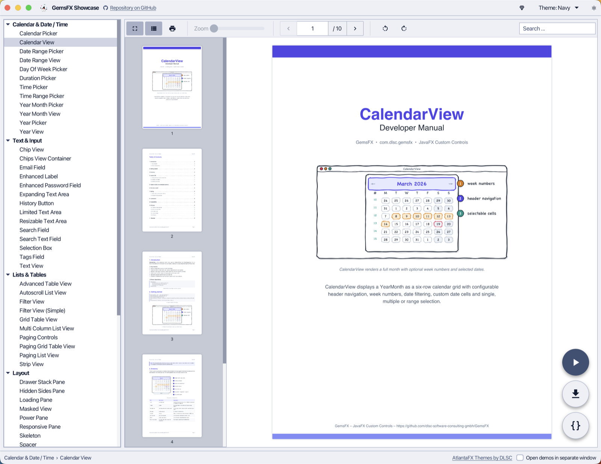

[](https://www.jfx-central.com/libraries/gemsfx)
[](https://search.maven.org/search?q=g:com.dlsc.gemsfx%20AND%20a:gemsfx)
[](https://opensource.org/licenses/Apache-2.0)
[](https://github.com/openjdk/jdk)
[](https://github.com/openjdk/jfx)

> Install the GemsFX demo launcher locally via jdeploy: [https://www.jdeploy.com/~gemsfxdemo](https://www.jdeploy.com/~gemsfxdemo)
> The demo will automatically update itself when new versions of GemsFX are released. You can also run the showcase application via Maven (see below).

# GemsFX

GemsFX is a collection of custom controls and utilities for JavaFX. The website is located at [https://gemsfx.dlsc.com](https://gemsfx.dlsc.com).

The `gemsfx` library module targets **Java 11** and **JavaFX 17+**. The `gemsfx-demo` and
`gemsfx-showcase` modules use **Java 24** / **JavaFX 25.0.2**.

## The showcase application

The `gemsfx-showcase` module is the central entry point for exploring GemsFX. It lists every control
of the library in one place, so you can find a control, read its documentation and see it in action
without writing a single line of code.



Run it with Maven:

```bash
mvn javafx:run -f gemsfx-showcase/pom.xml
```

What you can do with it:

- **Browse and search** – all controls are grouped by category (date &amp; time, text &amp; input,
  lists &amp; tables, layout, ...) and can be filtered via the search field.
- **Read the manual** – selecting a control opens its developer manual (the PDFs from
  `docs/manuals`) directly inside the application.
- **Try the control** – double-clicking a control launches the demo application of that control.
  Shift + double-click also opens the developer tools for the launched demo.
- **Switch themes** – the application uses AtlantaFX and lets you switch the theme family as well
  as between the light, the dark and the system color scheme, which is a convenient way to check how
  the controls look in your own theme.

Alternatively, the demo launcher can be installed locally via
[jdeploy](https://www.jdeploy.com/~gemsfxdemo). It updates itself whenever a new version of GemsFX
is released.

## Controls

GemsFX ships around 60 controls and utilities, each of them with its own developer manual. The
showcase application above is the best place to browse them:

- **Date &amp; time** – `CalendarView`, `CalendarPicker`, `DateRangeView`, `DateRangePicker`,
  `YearView`, `YearPicker`, `YearMonthView`, `YearMonthPicker`, `TimePicker`, `TimeRangePicker`,
  `DurationPicker`, `DayOfWeekPicker`
- **Text &amp; input** – `SearchTextField`, `SearchField`, `EnhancedPasswordField`, `EmailField`,
  `TagsField`, `ChipView`, `SelectionBox`, `ExpandingTextArea`, `ResizableTextArea`,
  `LimitedTextArea`, `TextView`, `HistoryButton`
- **Lists &amp; tables** – `AdvancedTableView`, `AutoscrollListView`, `FilterView`, `GridTableView`,
  `MultiColumnListView`, `PagingListView`, `PagingGridTableView`, `PagingControls`, `StripView`
- **Layout** – `DialogPane`, `DrawerStackPane`, `HiddenSidesPane`, `MaskedView`, `PowerPane`,
  `ResponsivePane`, `ThreeItemsPane`, `StretchingTilePane`, `Spacer`
- **Images &amp; graphics** – `PhotoView`, `AvatarView`, `SVGImageView`, `PaymentOptionView`,
  `BeforeAfterView`
- **Feedback &amp; progress** – `CircleProgressIndicator`, `ArcProgressIndicator`,
  `SemiCircleProgressIndicator`, `InfoCenterPane`, `LoadingPane`, `Skeleton`
- **Utilities** – `SessionManager`, `StageManager`, `HistoryManager`, `ResourceBundleManager`,
  `ScreensView`, converters and helpers in `com.dlsc.gemsfx.util`

The complete API documentation is published at [gemsfx.dlsc.com](https://gemsfx.dlsc.com), the PDF
manuals live in [`docs/manuals`](docs/manuals).

The payment option graphics used by `PaymentOptionView` were provided by Gregoire Segretain
(https://www.sketchappsources.com/contributor/gregoiresgt).

## Testing

The unit tests of the `gemsfx` module create real controls and therefore need a running JavaFX
toolkit. To make them work on CI servers without a display, the tests run on the
[Monocle](https://github.com/TestFX/Monocle) headless platform. The required system properties
(`glass.platform=Monocle`, `monocle.platform=Headless`, `prism.order=sw`, ...) are configured for the
surefire plugin in `gemsfx/pom.xml`, so no additional setup (Xvfb or similar) is needed.

All tests that need the toolkit extend `com.dlsc.gemsfx.FxTestBase`, which starts the toolkit once
per JVM and offers helpers to run code on the JavaFX application thread (`runFx`, `invoke`) and to
force skin creation (`layout`).

```bash
# run all tests of the library module
./mvnw test -pl gemsfx

# run a single test class
./mvnw test -pl gemsfx -Dtest=CalendarViewTest
```

## Documentation (Javadoc)

The published `gemsfx` module is held to a strict documentation standard, enforced by the Java
compiler's *DocLint* checker. The `maven-javadoc-plugin` in the root `pom.xml` runs with
`<doclint>all</doclint>` for the library, which validates syntax, HTML, accessibility and
cross-references **and** reports every undocumented public or protected type, method, constructor
and field. Warnings do not break the build, but Javadoc errors (such as broken `{@link}`
references) do. The `gemsfx-demo` module is exempt from the `missing` check because the demo
applications are not part of the published API.

Rules for new code in the `gemsfx` module:

* Every public and protected type, method, constructor and field carries a Javadoc comment.
* `@param` (including type parameters), `@return` and `@throws` are complete.
* For a JavaFX property triplet the documentation belongs **only** on the property accessor
  (`colorProperty()`); the getter, the setter and the backing field stay comment-free. The
  standard doclet copies the documentation over automatically and does not report those as
  missing.
* Methods annotated with `@Override` inherit their documentation and only need a comment when the
  behaviour genuinely deviates from the overridden method.
* Every package has a `package-info.java` with a short summary.

To check the documentation locally:

```bash
# generates the aggregated Javadoc and prints all DocLint warnings
./mvnw -B package -pl gemsfx
```

## AtlantaFX

GemsFX controls ship with their own user agent stylesheets, which are based on the CSS variables of
the standard JavaFX theme (Modena). When an application switches to an
[AtlantaFX](https://github.com/mkpaz/AtlantaFX) theme, those controls would keep their Modena look.

To avoid this, the library ships a companion stylesheet that redefines the GemsFX control rules in
terms of the AtlantaFX CSS variables. Use the utility class
`com.dlsc.gemsfx.util.GemsFXAtlantaFX` to apply it:

```java
// 1. Apply the AtlantaFX theme globally, before showing the stage
Application.setUserAgentStylesheet(new PrimerLight().getUserAgentStylesheet());

// 2. Apply the GemsFX companion stylesheet to the scene
GemsFXAtlantaFX.applyTo(scene);
```

`applyTo(Scene)` and `applyTo(Parent)` both add the stylesheet only once, so they are safe to call
repeatedly. The URL of the stylesheet is also available via the `GemsFXAtlantaFX.STYLESHEET`
constant, should you prefer to add it yourself. Note that the companion stylesheet only *consumes*
AtlantaFX colour variables (`-color-fg-default`, `-color-bg-subtle`, `-color-accent-emphasis`, ...):
GemsFX has no compile-time or runtime dependency on AtlantaFX, and without an active AtlantaFX theme
the controls simply fall back to their default appearance.

A sibling class, `com.dlsc.gemsfx.util.ControlsFXAtlantaFX`, does the same for the
[ControlsFX](https://github.com/controlsfx/controlsfx) controls that GemsFX uses internally.

The demo module shows this in action: `GemApplication` calls `GemsFXAtlantaFX.applyTo(scene)` when
the demos are started with the system property `-Datlantafx=true`.

## Installation
Adding GemsFX to your project.

#### Using Maven
Add the following dependency to your pom.xml:
<span id="maven-dependency"></span>
```xml
<dependency>
    <groupId>com.dlsc.gemsfx</groupId>
    <artifactId>gemsfx</artifactId>
    <version>4.4.1</version>
</dependency>
```

#### Using Gradle
Add the following dependency to your build.gradle:
<span id="gradle-dependency"></span>
```groovy
implementation 'com.dlsc.gemsfx:gemsfx:4.4.1'
```

## Internationalization (gemsfx module)

Scope is limited to the `gemsfx` library module. The `gemsfx-demo` module is intentionally out of scope.

### For library consumers

- GemsFX uses `ResourceBundleManager` (`com.dlsc.gemsfx.util`) for all built-in localized labels.
- The active locale defaults to `Locale.getDefault()`. Set a custom locale before creating controls:
  ```java
  ResourceBundleManager.setLocale(Locale.GERMAN);
  ```
- Locale changes clear the internal bundle cache and affect future lookups. Existing control instances are not guaranteed to live-refresh already created texts.

### Bundle and key conventions

- Bundle files are in `gemsfx/src/main/resources`.
- Base bundle names use kebab-case and map to `ResourceBundleManager.BundleType` entries (example: `duration-picker.properties`).
- Locale-specific files follow standard Java `ResourceBundle` naming (example: `duration-picker_de.properties`, `notification-view_zh.properties`).
- Keys use lowercase dot notation grouped by feature and intent (examples: `action.clear`, `placeholder.no-items`, `unit.long.minutes`).

### Contributor workflow for new translatable strings

1. Identify the target bundle from `ResourceBundleManager.BundleType`.
2. Add the key/value to the base bundle (`<bundle>.properties`) with the default text.
3. Add the same key to existing locale files for that bundle (`<bundle>_<locale>.properties`).
4. Use typed lookup in code:
   ```java
   ResourceBundleManager.getString(ResourceBundleManager.BundleType.DIALOG_PANE, "button.send", "Send")
   ```
   Use `ResourceBundleManager.format(...)` when arguments are required.
5. If a new bundle domain is needed, add a new `BundleType` enum constant and create its base/locale property files.

### Fallback behavior

- Java `ResourceBundle` locale fallback applies first (for example, `de_AT` → `de` → base bundle).
- If a bundle or key is still missing, `ResourceBundleManager` returns the provided fallback value.
- If no fallback value is provided, GemsFX falls back to the key itself.

## Contributing

Contributions are very welcome! Please read the
[contributing guidelines](.github/CONTRIBUTING.md) before opening a pull request — they describe the
build, the testing setup and the conventions used for controls, skins, CSS, properties,
accessibility and localization.

- [Code of Conduct](.github/CODE_OF_CONDUCT.md)
- [Support and questions](.github/SUPPORT.md) — please use
  [Discussions](https://github.com/dlsc-software-consulting-gmbh/GemsFX/discussions) for questions
- [Security policy](.github/SECURITY.md) — never report vulnerabilities in public issues

## License

GemsFX is licensed under the [Apache License 2.0](LICENSE).
